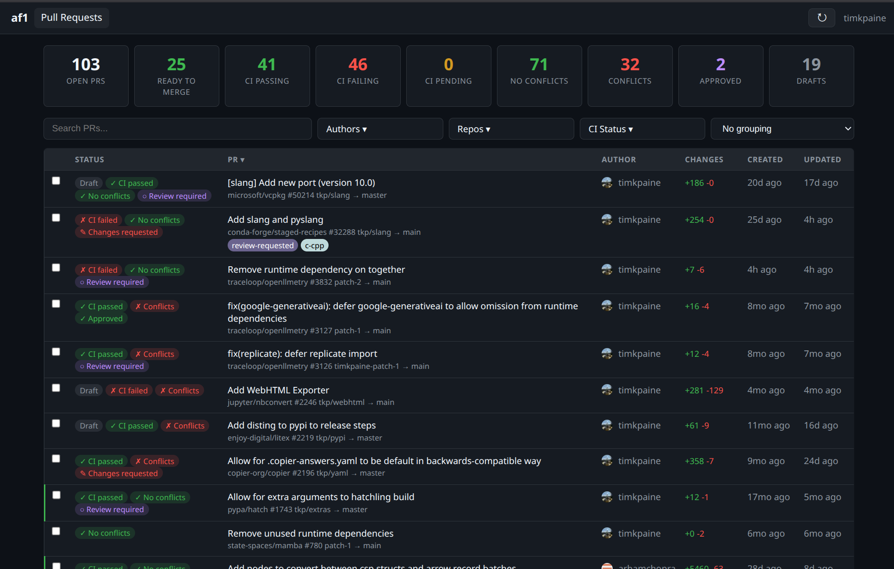

# af1

Mobile GitHub command center

## Overview

> [!NOTE]
> This library was generated using [copier](https://copier.readthedocs.io/en/stable/) from the [Base Python Project Template repository](https://github.com/python-project-templates/base).
